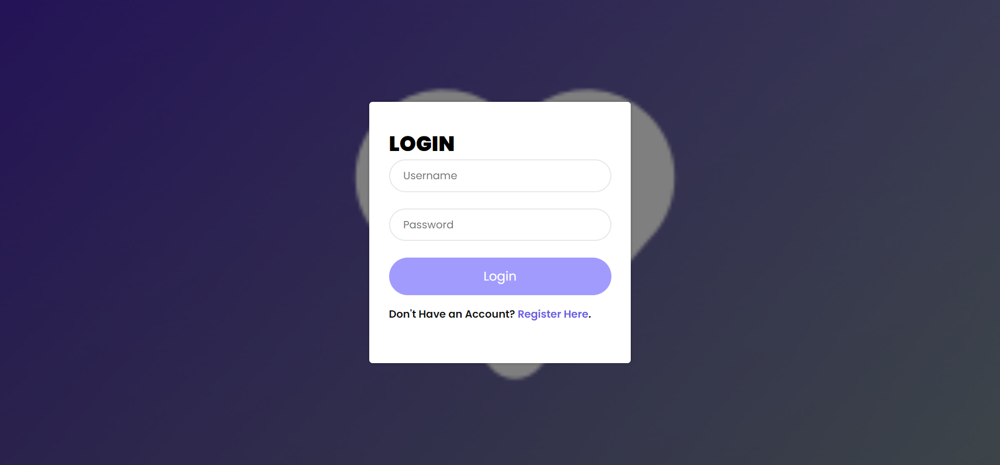
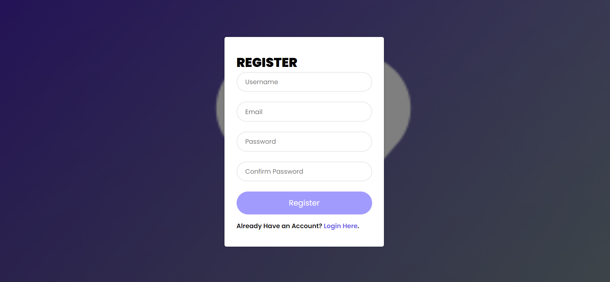
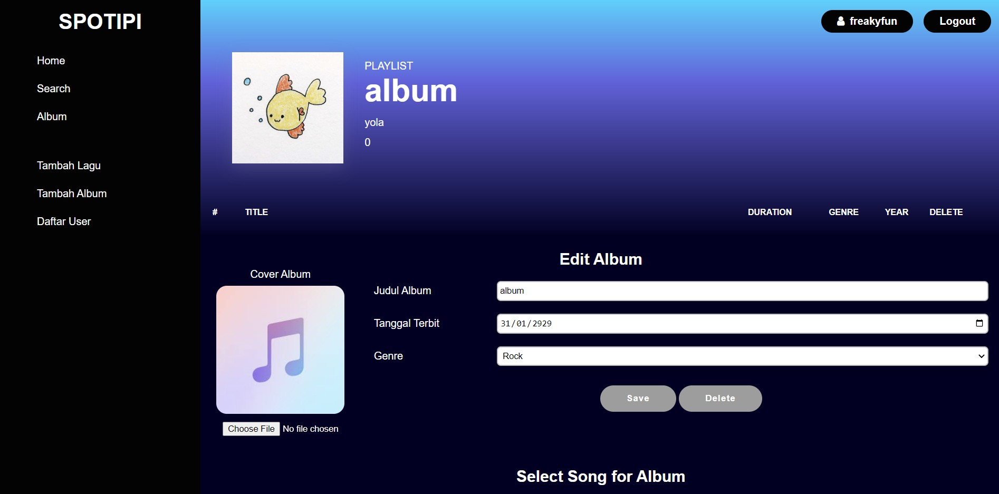
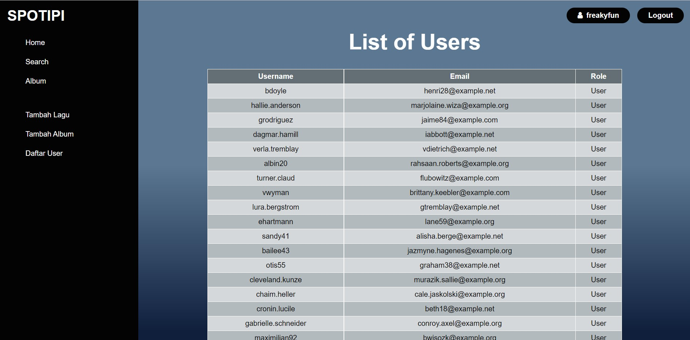
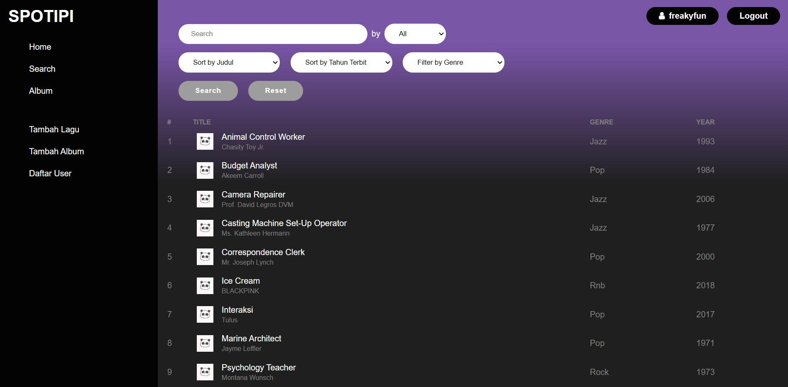

# IF3110 Pengembangan Aplikasi Berbasis Web

> _This is a project done to fulfil one of IF3110's course assignment._

## Description
   Aplikasi ini merupakan aplikasi berbasis web yang memiliki fungsionalitas utama seperti platform musik terkenal **SPOTIFY**. Aplikasi ini dibuat dengan menggunakan beberapa bahasa pemograman dan tanpa menggunakan library. Bahasa dan Tools yang digunakan di antaranya JavaScript, HTML, CSS untuk client side, PHP untuk server side, dan MYSQL untuk penyimpanan database.
   Halaman yang terdapat pada aplikasi ini adalah sebagai berikut:
   * Login
   * Register
   * Home
   * Daftar Album
   * Search, Sort, dan Filter
   * Detail Lagu
   * Detail Album
   * Tambah Album/Lagu
   * Daftar User

## Requirements
Untuk menjalankan program pastikan Anda telah mendownload dan menginstall hal-hal berikut:
1. Teks Editor
2. JavaScript
3. XAMPP
4. MySQL

## How To Install
1. Teks Editor yang kami sarankan adalah Visual Studio Code yang panduan download dan installnya dapat dilihat pada tautan berikut ini [vscode](https://www.belajarisme.com/tutorial/install-vscode/#:~:text=Sekarang%20mari%20kita%20install%20VSCode%20dengan%20cara%20berikut,Select%20Star%20Menu%20Folder%20klik%20Next.%20More%20items)
2. Panduan instalasi JavaScript dapat dilihat pada tautan berikut [JS](https://www.duniailkom.com/javascript-uncover-panduan-belajar-javascript-untuk-pemula/)
3. Panduan instalasi XAMPP dapat dilihat pada tautan berikut [XAMPP](https://webhostmu.com/cara-install-xampp/#:~:text=Cara%20Install%20XAMPP%20di%20Windows%201%201%29%20Download,8%29%20Tunggu%20proses%20instalasi%20selesai%20...%20More%20items)
4. Panduan instalasi MySQL dapat dilihat pada tautan berikut [MySQL](https://www.duniailkom.com/tutorial-mysql-download-install-dan-setingan-awal-mysql/)
## How To Run
Buka folder htdocs yang berada di dalam folder XAMPP, lalu clone repository ini. Selanjutnya jalankan
link berikut ini pada browser di komputer Anda (localhost/tugas-besar-1). Lalu, download database dengan judul *spotify.sql* pada folder database dan lakukan import pada file tersebut. Sesuaikan database pada file config.php jika dibutuhkan database baru atau biarkan untuk menggunakan database remote yang sudah terisi.

## Screenshot
1. Halaman Login 
2. Halaman Register 
3. Halaman Homepage
4. Halaman Tambah Album dan Lagu
5. Halaman Daftar Album 
6. Halaman Detail Album 
7. Halaman Detail Lagu 
8. Halaman Daftar User 
9. Halaman Search, Sort, Filter 

## Authors
<table>
  <tr >
      <td><b>Nama</b></td>
      <td><b>NIM</b></td>
      <td><b>Client Side</b></td>
      <td><b>Server Side</b></td>
    </tr>
    <tr >
      <td><a href="https://gitlab.informatika.org/leoniantoinette"><b>Flavia Beatrix Leoni Antoinette Santoso</b></a></td>
      <td>13520051</td>
      <td>Membuat Sort, Filter, Search Page, Tambah/Delete Album, dan Daftar User</td>
      <td>Membuat Sort, Filter, Search Page, Tambah/Delete Album, dan Daftar User</td>
    </tr>
    <tr>
      <td><a href="https://gitlab.informatika.org/febryola"><b>Febryola Kurnia Putri</b></a></td>
      <td>13520140</td>
      <td>Membuat Database, Halaman Login, Register, dan Detail Album</td>
      <td>Membuat Database, Halaman Login, Register, dan Detail Album</td>
    </tr>
    <tr>
      <td><a href="https://gitlab.informatika.org/Aloysiusgilang"><b>Aloysius Gilang Pramudya</b></a></td>
      <td>13520147</td>
      <td>Membuat Halaman Home, Daftar Album, dan Detail Album</td>
      <td>Membuat Halaman Home, Daftar Album, dan Detail Album</td>
    </tr>
</table>
